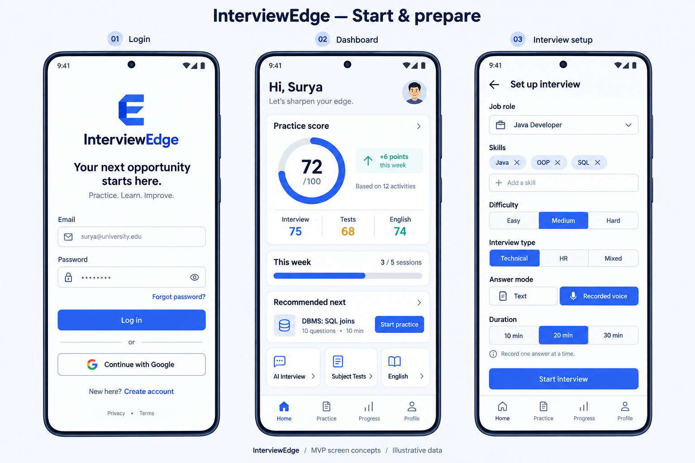
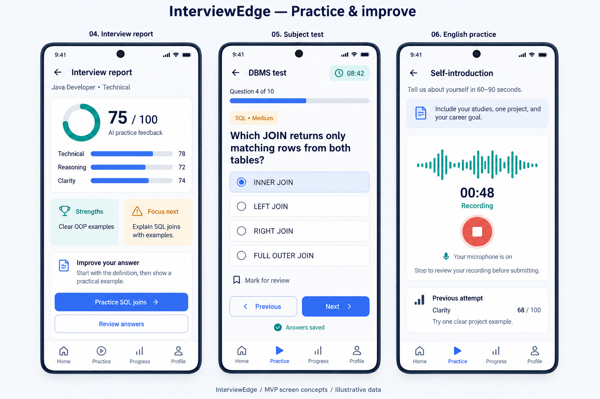
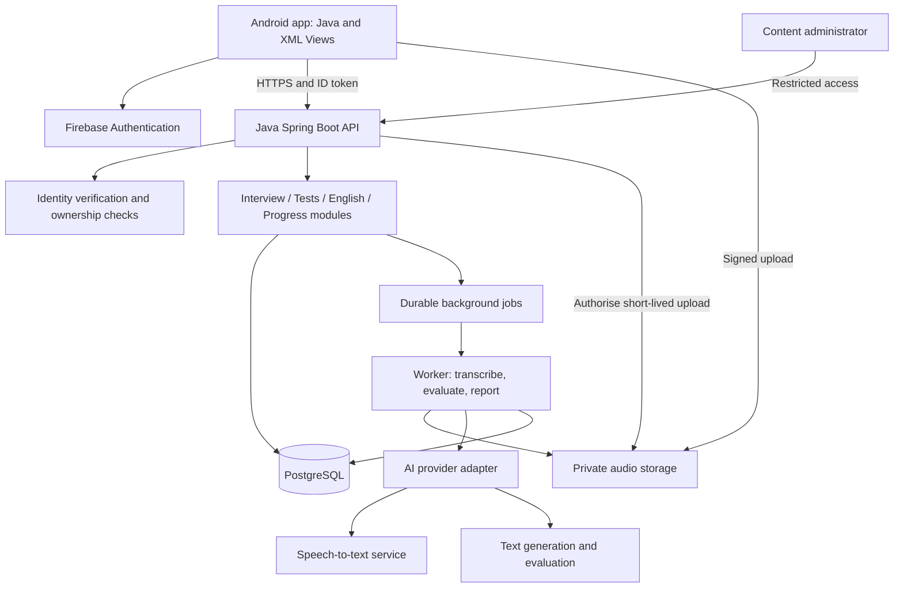

# InterviewEdge — Project and MVP Design

**Status:** Proposed product design, September 2026. No application implementation is included.

## Visual concepts

**Login, dashboard and interview setup**

**Interview report, subject test and English recording**

The boards were created with the built-in image generation tool. Exact generation prompts are saved in [Mockup-Prompts.md](Mockup-Prompts.md). All names, scores and progress values shown are illustrative. Final UI should follow the behaviour and scoring definitions below.

## 1. Product idea

InterviewEdge is an Android placement preparation companion that helps students practise interviews, test their CS knowledge, improve spoken English, and decide what to practise next. Its central loop is:

**Choose a goal → practise → receive feedback → update competencies → get a targeted next activity → practise again.**

The shared competency profile is the distinguishing feature. For example, weak explanations of SQL joins in an interview and incorrect SQL questions in a DBMS test should both inform the same SQL competency. The next recommendation can then be a short joins test followed by another interview question.

Primary users are students preparing for internships and entry-level jobs. A content administrator maintains the reviewed question bank. Institution dashboards, recruiter access, and social leaderboards are outside the MVP.

Success means students understand their feedback, complete recommended practice, and improve on fresh questions of comparable difficulty. Time spent and streaks are supporting engagement measures, not proof of learning.

## 2. Requirements and boundaries

| Area | MVP requirements | Later expansion |
|---|---|---|
| Identity | Email/password, password reset, email verification, Google sign-in, logout | Institution sign-in |
| Profile | Name, optional college/course/year, target role, selected skills, weekly goal | Resume import, multiple career tracks |
| Mock interview | Technical, HR, mixed; role, skills, difficulty, 10/20/30-minute options; text or recorded answers; bounded adaptive follow-ups | Resume-based interviews, continuous voice conversation |
| Interview feedback | Overall and rubric scores, evidence, strengths, weaknesses, improved answers, next topics, history | Expert review, richer role-specific rubrics |
| Subject tests | DSA, DBMS, OS; MCQs, code-output questions, curated short answers; timed fixed tests; topic results and explanations | Adaptive test selection, programming judge, additional subjects |
| English | Self-introduction recording, transcript, grammar/relevance/clarity feedback, approximate rate and fillers, retry comparison | Read-aloud, topic speaking, role-play, validated pronunciation assessment |
| Progress | Circular practice score, module scores, topic detail, weekly goals, activity history, trends | Cohort analytics with explicit sharing |
| Recommendations | Rules based on weaknesses, missing evidence, recency and target role | Learned recommendation ranking |
| Content management | Protected question import, review, publish, retire and correction workflow | Full editorial portal |

Recorded voice means a student records one answer, reviews it, submits it, and receives the next question. Interview questions appear as text in the MVP. Spoken AI questions can be added separately.

Adaptive interviews are in the MVP. Adaptive tests are a later increment: the initial verified bank may be too small to support balanced adaptive selection reliably. The data design supports both modes from the start.

Code-output questions display a fixed snippet and ask for its output; they do not run student code. The MVP does not require a compiler or code execution service.

### Functional acceptance criteria

- A new student can register, set a target role and reach the dashboard.
- A returning student lands on the dashboard after login.
- Each interview answer is saved once, even after a network retry.
- A follow-up refers to the previous answer and stays within the selected role, topics and difficulty limits.
- A completed activity produces one report and one logical contribution to progress.
- Test answers and explanations are released only after submission or expiry.
- English retries preserve earlier attempts and show a comparison of the same activity.
- All saved recommendations explain why they were selected.
- No evidence produces “Not assessed yet,” rather than a fabricated score.

### Quality targets to validate during development

- Design for common Android phones, small screens, text scaling and screen readers.
- Ordinary API requests: target p95 below one second at pilot load, excluding uploads and AI work.
- Target text follow-ups within about 10 seconds and reports within about 30 seconds under normal provider conditions; measure and revise after integration.
- Show explicit recording, uploading, transcribing, analysing, ready and failed states. Never imply that failed analysis is a zero score.
- Preserve drafts and permit safe retries after interruptions. Live AI activities require connectivity; cached reports can be read offline.
- Track provider cost per completed activity, report latency, error rates and duplicate submissions.

These are proposed acceptance targets, not measured performance or service guarantees.

## 3. User experience and navigation

**Bottom navigation:** Home · Practice · Progress · Profile.

Home is the dashboard. Practice contains the three modules. Progress contains detailed competency and activity history. Profile contains goals, account settings, privacy, export and deletion.

### First-time journey

Launch → register/sign in → verify email where applicable → select target role and skills → choose weekly practice goal → dashboard.

The first dashboard uses a neutral empty ring and a “Build your baseline” action. It suggests one short activity per module. Optional college information should not block onboarding.

### Interview journey

Practice → AI Interview → setup → instructions → session → finish → report processing → report → targeted practice.

Setup includes role, skills, difficulty, Technical/HR/Mixed, Text/Recorded voice and duration. HR interviews assess answer structure, relevance and concrete examples; they do not score technical accuracy when no technical question was asked.

The session screen shows the current question, remaining answer time, answer editor or recording control, save status and an end action. A voice answer supports stop, playback, discard/re-record, transcript review and submit. Ask for microphone permission only when recording is selected.

For MVP interviews, selected duration is an answer-time budget: provider processing time is excluded by server-side accounting. A maximum wall-clock lifetime also prevents abandoned sessions remaining active indefinitely. Label the timer clearly. Tests use a separate fixed server deadline.

On microphone denial, allow the interview to switch to text. On English recording denial, explain how to enable the microphone and retain the activity prompt; typed text cannot stand in for speaking evidence.

### Test journey

Practice → Subject Tests → DSA/DBMS/OS → topic, difficulty and length → instructions → timed questions → submit/expiry → score and review → recommended topic.

Allow previous/next, mark for review and autosave. On timeout, the server finalises saved responses. A lost connection does not pause the server deadline; show this before starting and retry saves while time remains. Unsynced late answers cannot silently change a final result.

### English journey

Practice → English → Self-introduction → 60–90-second prompt → record → playback/transcript review → submit → feedback → retry → compare.

Suggested prompt: “Introduce yourself, describe one project, explain your contribution, and state the role you want.” Compare attempts with the same prompt and rubric. Show both first-to-latest and previous-to-latest changes when useful.

## 4. Screen and visual design

Use a calm, focused student learning interface: pale background, white cards, dark text, blue primary actions, teal strengths and restrained amber improvement cues.

| Token | Proposed value |
|---|---|
| Background | #F6F8FC |
| Primary | #325DEB |
| Main text | #17253F |
| Positive accent | #159A88 |
| Card treatment | Subtle border, 16–20 dp radius |
| Spacing | 8 dp rhythm; approximately 20 dp screen padding |
| Typography | Familiar Android sans-serif; clear heading/body hierarchy |
| Interaction | At least 48 dp touch areas as a design target |

Use icons with labels, readable timer text, visible focus and error states, and chart text alternatives. Do not rely only on red/green or animate a score so much that it becomes distracting. Verify final contrast on actual components.

### Screen inventory

| Screen | Essential content and actions |
|---|---|
| Login/register/reset | Credentials, Google sign-in, validation, reset, privacy links |
| Onboarding | Role, skill chips, optional education, weekly goal |
| Dashboard | Circular score, module summaries, weekly goal, recommended next activity, module shortcuts |
| Practice hub | Interview, Subjects, English; brief descriptions and estimated duration |
| Interview setup | Role, skills, difficulty, type, answer mode and duration |
| Interview session | Question, timer, editor/recorder, submit, processing state, end |
| Interview report | Score breakdown, evidence, strengths, improvements, better answer, next action |
| Test catalogue/setup | Subjects, topics, difficulty, format, length and instructions |
| Test player | Question, timer, answer controls, review marker, navigation, save status |
| Test result | Score, topic breakdown, reviewed solutions and explanations |
| English recorder | Prompt, timer, waveform, record/stop, playback and submit |
| English feedback | Transcript highlights, metrics, suggested wording, retry and comparison |
| Progress detail | Topic scores, coverage, dates, trends, filters and activity history |
| Profile/privacy | Goals, preferences, recording retention, export, delete and logout |

The accompanying two image boards illustrate six key screens. They are visual concepts using sample data, not functional screens or a complete interaction specification.

### Dashboard chart: what the circle means

Use a single circular progress ring labelled **Practice score**, with “72 / 100” inside and a neutral remainder. Do not turn independent module scores into pie slices: those values are not parts of one total.

Under the ring show Interview 75, Tests 68 and English 74. A proposed initial summary is:

**Overall = 40% × Interview + 40% × Tests + 20% × English = 72.**

These are product weights for a practice index; they require pilot validation and are not a placement probability. Keep the weights fixed and versioned for comparable trends.

Separate three concepts:

1. **Performance:** practice score and skill breakdown.
2. **Completion:** “3 of 5 sessions this week.”
3. **Evidence coverage:** assessed topics and number of eligible activities.

For a new user, show no overall number. Show an initial overall score only after all three modules have at least one eligible activity, labelled “Early estimate.” Show stronger evidence only after broader activity and topic coverage. Missing scores stay null, not zero. If a module becomes stale, label the overview “Needs refresh.”

The trend compares saved snapshots under the same scoring version, target-role context and comparable difficulty. Suppress a delta when there is no comparable previous snapshot. Students can tap the ring to see calculation, coverage, source activities and last update.

## 5. Architecture and recommended stack

### Stack

| Layer | Proposed choice | Reason |
|---|---|---|
| Android app | Java, XML Views, Material Components | Matches the preferred language and native Android workflow |
| App organisation | Single Activity, Fragments, ViewModel, LiveData, repositories | Keeps screens, state and data access separate |
| Networking | Retrofit/OkHttp or equivalent maintained HTTP client | Typed requests, authentication and retry handling |
| Local storage | Room for cached reports/drafts; private audio files | Supports recovery and limited offline reading |
| Deferred device work | WorkManager for eligible upload/sync retries | Durable background retry; no hidden background recording |
| Backend | Java with Spring Boot, Spring Security and JPA | One language across core app and server logic |
| Authentication | Firebase Authentication | Managed sign-in, verification and recovery |
| Main database | PostgreSQL | Relational attempts, versioned content and transactional updates |
| Audio storage | Private managed object storage | Keeps large files out of database rows |
| AI | Backend adapter to a text model and transcription service | Provider flexibility and server-held credentials |
| Background jobs | Database-backed durable jobs and worker | Survives server restarts without introducing many services |

Java remains supported by Android Studio and Android APIs. Android's current guidance is Kotlin-first and Compose is Kotlin-oriented; this Java proposal deliberately uses XML Views. See [Android language guidance](https://developer.android.com/kotlin/first).

The app layering follows the separation of UI, state and repositories described in [Android Views architecture guidance](https://developer.android.com/topic/architecture/views/recommendations-views). Java-compatible observation and background work should be used instead of assuming Kotlin coroutine APIs.

### System structure

Start with a **modular monolith**: one backend application with clear internal modules, plus a worker from the same codebase. Microservices, a vector database and a custom-trained model are unnecessary for the proposed MVP.

The server owns question selection, test timing, scoring, access control and competency calculations. The phone displays state, captures answers and handles local recovery. It cannot award itself scores.

Firebase handles login. The app sends a Firebase ID token with each protected API request; the backend verifies it and derives the user identity from that verified token. This follows [Firebase's backend verification guidance](https://firebase.google.com/docs/auth/admin/verify-id-tokens). Do not create a second password database or trust a user ID supplied in a request body.

For deployment, use one managed backend runtime, a worker, managed PostgreSQL and private object storage, with separate development and production environments. Confirm compatible Java and framework versions during implementation using [Spring Boot documentation](https://docs.spring.io/spring-boot/reference/index.html).

## 6. Database design

Use UUID primary keys, foreign keys, UTC timestamps, status fields and migrations. Store audio in object storage; store only its private object key and metadata in PostgreSQL.

| Entity | Key fields and purpose |
|---|---|
| users | id, unique auth_uid, status, created_at, deleted_at |
| profiles | user_id, display_name, optional education, target_role_id, weekly_goal, timezone |
| roles, skills, role_skills, user_skills | Controlled role/skill catalogue and many-to-many selections |
| subjects, topics, competencies | DSA/DBMS/OS hierarchy and shared measurable skills |
| question_versions | question_id, version, topic, type, difficulty, prompt, language/runtime, reference_answer, rubric_version, source/licence, reviewer, publication_status |
| question_options | question_version_id, option_id, text, is_correct; correctness remains server-only |
| question_competencies | question_version_id, competency_id, contribution_weight |
| activities | id, user_id, module, state, target_role_snapshot, rubric/scoring_version, started_at, completed_at |
| interview_sessions | activity_id, type, skills_snapshot, starting_difficulty, answer_mode, answer_budget, remaining_budget, wall_expires_at, state_version |
| interview_turns | id, activity_id, sequence, parent_turn_id, generated_question, competency_tags, difficulty, rubric/reference_snapshot |
| media_assets | id, owner_id, storage_key, mime_type, bytes, duration, checksum, upload_state, delete_after |
| answers | id, activity_id, turn/item_id, text, media_id, raw_transcript, confirmed_transcript, transcript_edited, submission_key, submitted_at |
| test_attempts | activity_id, subject, mode, difficulty, question_count, server_deadline, bank_version |
| test_items | id, activity_id, question_version_id, display_order, option_order, points_possible |
| test_responses | test_item_id, selected_option_id or answer_text, save_version, submitted_at, awarded_points, grading_status |
| english_prompts | id, version, activity_type, prompt, target_duration, rubric_version |
| english_attempts | activity_id, prompt_version, retry_group_id, previous_attempt_id, media_id, transcript, metrics_json |
| evaluations | id, answer/activity_id, status, rubric_version, model/prompt_version, dimension_scores_json, evidence_json, feedback_json |
| reports | activity_id, report_version, status, summary_json, strengths, improvement_topics, overall_score |
| competency_evidence | id, user_id, activity_id, evaluation_id, competency_id, score, reliability_weight, eligible, created_at |
| user_competencies | user_id, competency_id, score, evidence_count, distinct_activity_count, last_assessed_at, scoring_version |
| progress_snapshots | user_id, snapshot_time, role_context, scoring_version, module_scores_json, overall_score, coverage_json |
| recommendations | id, user_id, activity/topic target, reason_code, explanation, priority, evidence_ids, rule_version, status, expires_at |
| ai_jobs | id, activity_id, kind, dedupe_key, status, retry_count, lease_until, next_run_at, error_code |
| consents, audit_events, deletion_jobs | Consent versions, sensitive/admin operations, durable deletion progress |

### Main relationships

- One user has one profile and many activities.
- Every activity belongs to exactly one module subtype: interview, test or English.
- Interviews have many turns; each turn has at most one accepted answer, with revisions preserved if needed.
- Test attempts contain immutable references to question versions and one saved response per item.
- English retries share a retry group and prompt version.
- Final evaluations create competency evidence; many evidence rows contribute to one user-competency aggregate.
- Reports and recommendations reference source activities so students can inspect why their profile changed.

### Integrity and history rules

- Unique constraints on auth_uid, interview sequence, test item response and evidence source prevent duplication.
- Validate that a selected option belongs to the question version on that attempt.
- Publish immutable question versions. Editing a live question creates a new version; previous reports remain reproducible.
- Store reviewed answer keys in server-only tables/fields and exclude them from active-test responses.
- Keep relational columns for identities, dates, states and scores; JSON is for bounded structured feedback, not the whole database.
- Index user/activity time, user/competency, question topic/difficulty/status and due job status.
- Report finalisation, evidence creation and aggregate update should be one transaction or an idempotent transactional-outbox workflow.
- Regrading supersedes the old evaluation and evidence before rebuilding aggregates; it never adds a second contribution.
- Account deletion covers database data, media, cached exports and provider-held data where supported, with documented backup expiry.

## 7. API design

Base path: `/api/v1`. All student endpoints require a verified identity except public configuration where intentionally allowed. Auth registration/login/reset use Firebase SDK operations.

| Method and path | Responsibility |
|---|---|
| GET /me | Current profile and onboarding status |
| PATCH /me | Update allowed profile and goal fields |
| GET /catalog | Roles, skills, subjects, topics and English prompts |
| GET /dashboard | Summary, coverage, weekly goal, recent activity and recommendations |
| GET /competencies | Topic/dimension detail with evidence and last update |
| GET /progress?period=30d | Historical snapshots and filtered activity summary |
| GET /activities | Paginated activity history |
| POST /media/upload-intents | Validate intent; create owner-bound media ID and short-lived upload URL |
| POST /media/{id}/complete | Verify stored file, size, checksum and type before processing |
| POST /media/{id}/transcriptions | Queue transcription of owned, validated audio |
| POST /interviews | Create session from role, skills, difficulty, type, mode and duration |
| GET /interviews/{id} | Resume authoritative current state and question |
| POST /interviews/{id}/answers | Accept text or processed media answer, check expected turn, queue follow-up |
| POST /interviews/{id}/finish | Finalise session and queue report |
| GET /interviews/{id}/report | Report or its processing state |
| POST /tests/attempts | Create fixed test and server deadline; return question content without keys |
| GET /tests/attempts/{id} | Resume question set, saved answers and deadline |
| PUT /tests/attempts/{id}/responses/{itemId} | Save/version a response before deadline |
| POST /tests/attempts/{id}/submit | Atomically finalise and score saved responses |
| GET /tests/attempts/{id}/result | Score, grading status, solutions and explanations after finalisation |
| POST /english/attempts | Create attempt tied to prompt version and optional retry group |
| POST /english/attempts/{id}/submit | Submit owned audio/transcript for analysis |
| GET /english/attempts/{id}/report | Metrics, feedback and same-prompt comparison |
| GET /recommendations | Prioritised next activities with reasons |
| PATCH /recommendations/{id} | Dismiss or record action; completion verified from activity |
| GET /jobs/{id} | Owner-restricted queued/working/completed/failed status |
| POST /me/exports | Queue private downloadable account export |
| DELETE /me | Request authenticated account deletion |
| POST /admin/questions/import | Restricted draft question import |
| POST /admin/questions/{id}/publish | Restricted reviewed-version publication |

### Contract rules

- Use `Authorization: Bearer <Firebase ID token>`; the backend determines ownership.
- Creation/submission operations accept an idempotency key. Reusing a key with different content returns a conflict.
- Return 202 and a job ID for long work, 201 for created records and explicit status for incomplete reports.
- Use expected turn/state versions to prevent a retry attaching an answer to the wrong question.
- Standard errors include code, friendly message, field errors and request ID. Use 401/403/404 appropriately, 409 for stale state, 422 for invalid content and 429 with retry guidance for rate limits.
- Poll jobs with backoff in the MVP. Streaming is optional later.
- Enforce limits on page size, answer length, recording duration, file bytes and daily AI usage.

## 8. AI workflows

### A. Adaptive mock interview

1. Validate setup and load a role-specific topic plan and rubric.
2. Start with a reviewed seed question or generate a question grounded in approved topic/reference material.
3. Save the exact question, rubric, tags and difficulty before showing it.
4. Accept a typed answer or transcribe a validated recording.
5. Let the student review the transcript; preserve raw and confirmed versions.
6. Evaluate the answer against explicit criteria and reference facts. Request evidence excerpts and missing concepts.
7. A server-controlled policy selects clarify, probe, increase/decrease difficulty within bounds, move topic or finish.
8. Generate the next question from that permitted action and the relevant answer context.
9. At completion, build a report from validated evaluations; compute numeric totals on the backend.
10. Finalise evidence and recalculate profile/recommendations once.

Example: “What is an index?” → student mentions faster lookup → “What trade-off does an index introduce for inserts?” If the answer is incomplete, a simpler clarification can precede a new topic.

Limit follow-ups per topic (initially two), enforce time/question caps, avoid recently repeated questions and maintain coverage. A bounded server policy makes behaviour easier to test than an unconstrained chat conversation.

Proposed technical rubric: correctness 40%, reasoning 30%, explanation clarity 20%, relevance 10%. Proposed HR rubric: relevance 30%, structure 25%, concrete examples 30%, clarity 15%. Score each dimension on an anchored 0–4 scale and normalise to 100. A mixed session uses applicable per-question rubrics and records the mix.

Do not infer personality, honesty, emotion or employability from voice. Technical knowledge should remain distinct from grammar. Improved answers must not invent achievements or project experience on the student's behalf.

### B. Verified subject tests

Content lifecycle: author/import → source and licence check → independent subject review → verify answer and explanation → publish immutable version → student dispute/correction → retire or revise.

Seed planning target: approximately 50 reviewed questions per subject across a deliberately limited topic set. Prefer adequate topic coverage over a large unreviewed bank. For code-output questions, specify language/runtime assumptions and avoid ambiguous or undefined behaviour; verify outputs during editorial preparation.

- MCQ/code-output selection: backend compares against the reviewed key and computes points.
- Short answer: use a reviewed criterion rubric. Deterministic criteria are authoritative where possible; AI-assisted grading is labelled provisional unless it meets the validated grading policy. Uncertain items remain pending/unscored and do not silently become zero.
- AI explanations receive the published reference solution and the student's response. AI cannot change the reviewed key.
- If AI fails, show the reviewed explanation and retain the objective result.
- During pending grading show an objective subtotal and pending item count. Only eligible finalised evidence updates the profile.

Later adaptive tests can start at medium difficulty and select a new reviewed item after each answer, adjusting difficulty according to transparent rules. Preserve topic quotas, avoid repeats and record the selection path. Do not compare raw percentages across different difficulty mixes as if they were identical tests.

### C. English self-introduction

Record → check audio quality → transcribe → review transcript → compute measurable audio/text features → rubric evaluation → feedback → retry comparison.

| Measure | Source | Interpretation |
|---|---|---|
| Grammar | Transcript and language-model feedback | Highlight wording and offer corrections |
| Relevance | Transcript compared with prompt | Studies/project/contribution/goal coverage |
| Clarity/structure | Transcript rubric | Logical order and concrete examples |
| Filler count | Verbatim transcript where available | Approximate; recognition may omit fillers |
| Speaking rate | Word count and validated recording duration | Words divided by minutes; define treatment of silence |
| Pauses/hesitation | Audio timing or voice activity analysis | Optional if trustworthy timing exists |
| Pronunciation | Dedicated validated acoustic assessment | Later feature; not inferred from text alone |

The MVP English summary can weight grammar 30%, clarity 35% and relevance 35%, with rate and filler estimates presented separately. Label it a content/communication practice score. Fluency observations may be qualitative when audio timing is unavailable; never manufacture pause metrics from plain text.

Use raw audio-aligned transcription for rate/fillers. If the student edits the transcript, score the edited wording as language practice and mark it edited; exclude those changed language scores from the speaking competency comparison. Low-quality, silent or unintelligible recordings prompt a retry instead of a misleading assessment. A good pace depends on task and speaker; do not maximise speed or punish accent differences.

Recorded transcription is supported by [OpenAI's file transcription guidance](https://developers.openai.com/api/docs/guides/speech-to-text). Timing and output capabilities vary by model; check them when selecting the provider/model.

### Shared AI contract and safeguards

Require structured fields such as rubric_version, dimension_scores, evidence, strengths, improvements, improved_answer, next_topics and evaluation_status. Validate shape, score ranges, allowed topics and evidence on the server. [OpenAI Structured Outputs](https://developers.openai.com/api/docs/guides/structured-outputs) supports schema-constrained responses; valid structure does not guarantee a correct educational judgment, and failures/refusals still need handling.

Keep interview generation and evaluation as separate responsibilities. Store model/prompt/rubric versions, run an evaluation set before changes and use bounded retries. On provider failure, retain answers, mark work pending and offer retry; never fabricate a report.

Student answers and later resumes are untrusted data. They cannot override grading rules, reveal prompts/keys or trigger arbitrary tools. AI receives only needed content and has no direct authority to query arbitrary users, write scores or access storage.

## 9. Shared competency profile and recommendations

Suggested competencies include Java/OOP, arrays, complexity, SQL joins, normalisation, processes/threads, deadlocks, technical reasoning, explanation clarity, HR answer structure, grammar and spoken response organisation.

An interview about joins and a DBMS question about joins map to one shared competency ID. Record each source's type and reliability so the student can see where evidence came from. Self-selected skills are interests, not assessed competence.

### Initial aggregation policy

1. Normalise eligible criterion scores to 0–100.
2. Within one activity, combine evidence for each competency so many follow-ups cannot dominate the profile.
3. Use the latest five distinct eligible activities for each competency, with documented reliability weights. Keep the full history.
4. Group immediate same-prompt retries for aggregate contribution; show every retry in history but cap repeated contribution to avoid score farming.
5. Show evidence count, coverage and age separately. Low/medium/high evidence is a heuristic label, not a statistical confidence interval or the model's self-reported confidence.
6. Build module summaries from eligible activity-level scores, balancing the covered subject/topic set. Label narrow coverage; unassessed topics stay null.
7. Save comparable overall snapshots using the dashboard's fixed 40/40/20 policy.

Only the source module receives an activity's contribution to its module summary. A shared topic can use evidence from multiple modules, but one interview does not also become a second test activity in the overall score.

### Recommendation rules in priority order

| Condition | Next action | Explanation shown |
|---|---|---|
| Module lacks baseline evidence | Short starter activity | “Complete one English activity to build your baseline.” |
| Recent data is too limited | Short diagnostic | “Try a few more SQL questions to confirm your level.” |
| Skill below 60 with sufficient evidence | Beginner topic practice | “SQL joins were difficult in two recent activities.” |
| Skill 60–79 | Medium applied practice | “Practise explaining joins using a concrete example.” |
| Skill at least 80 over multiple fresh items | Harder activity | “You answered recent medium questions accurately.” |
| Relevant skill not practised recently | Short revision activity | “Refresh operating-system fundamentals.” |
| Repeated issue in English | Same-activity retry with one focus | “Describe one project in a clear beginning–middle–end order.” |

Thresholds are initial rules to calibrate. Rank by target-role relevance and evidence, keep suggestions varied, use cooldowns for dismissed/repeated work and show at most three recommendations. Exclude pending or unreliable evaluations from weakness rules.

## 10. Security and privacy

Use [OWASP MASVS](https://mas.owasp.org/MASVS/) as the mobile security verification baseline, covering storage, cryptography, authentication, network and platform controls. The following are proposed application controls.

- **Identity and access:** verify tokens server-side, enforce owner checks on every activity/media/report/job ID, restrict administration by role, and require stronger authentication for administrators. Never trust client-supplied role or score fields.
- **Secrets:** keep model keys and server credentials in server secret storage. Never embed them in the APK or logs.
- **Transport and storage:** HTTPS, private buckets, encrypted managed storage, short-lived owner-bound media URLs, minimal app-private cached data, and platform-backed key protection where device encryption is needed.
- **Uploads:** enforce ownership, maximum bytes/duration, actual media format validation and safe filenames/keys. Process only supported audio; remove invalid uploads and expire unused upload intents.
- **Recording consent:** request microphone access in context, show a recording indicator and stop recording when the user stops or leaves the activity according to an explicit interruption policy. Do not record secretly in the background.
- **Privacy:** explain which recordings/transcripts reach which provider, collect only necessary profile data and offer export/deletion. Do not expose reports to colleges or employers by default.
- **Retention:** proposed default deletes raw audio after successful analysis plus a short recovery window; longer retention for replay is opt-in with an expiry. Preserve reports until user deletion or the published account policy. Final durations must be documented before launch.
- **AI safety:** treat inputs as data, limit model output and cost, validate output, ground explanations in reviewed material and prevent arbitrary tool execution.
- **Abuse and correctness:** per-user quotas, upload limits, endpoint rate limits, server deadlines and idempotent finalisation. Generic login errors should avoid disclosing account existence.
- **Operations:** exclude tokens/transcripts/raw audio from routine logs; audit administrative publishing and sensitive data access; patch dependencies, back up data and test restores.
- **Launch review:** establish the intended student age range, deployment region and applicable privacy obligations before public release; handle deletion in backups and provider systems according to documented capabilities and policy.

## 11. Testing strategy

| Layer | High-value checks |
|---|---|
| Unit | Rubric totals, score normalisation, missing evidence, repeated retries, recommendation thresholds, deadline accounting |
| Database/integration | Ownership, immutable question references, transaction rollback, duplicate jobs, regrading and concurrent submissions |
| API contracts | Invalid/expired tokens, forbidden IDs, invalid options, stale turns, idempotency, pagination, rate limiting |
| Android UI | Registration → dashboard; all three activity flows; navigation, text scaling, dark/light contrast if supported |
| Device resilience | Rotation/process death, low memory, microphone denied, phone-call interruption, corrupt recording, reconnect and expired test |
| Content QA | Independent review of every published answer key, plausible distractors, topic/difficulty tags, code-output verification |
| AI evaluation | Correct/partial/wrong answers, hallucination, weak evidence, prompt injection, unfair language penalties, follow-up relevance |
| Speech evaluation | Different accents/speakers, noisy rooms, silence, short recordings, recognition mistakes, edited transcripts |
| Security | Cross-account access attempts, exposed keys, private media URLs, malicious uploads, log leakage, export/deletion |
| Performance | Pilot concurrent sessions, worker backlog, large permitted uploads, provider slowdowns, retry storms and per-session cost |

Create a human-reviewed evaluation set with example answers and scoring ranges. Compare model grades with reviewer grades; inspect disagreement and stability before changing prompts or models. A proposed initial gate is at least 90% of dimension ratings within one point of reviewer consensus on the 0–4 rubric, with no unresolved severe grounding or access-control failures. Calibrate this against pilot quality rather than treating it as a universal benchmark.

Release gates include deterministic correctness for published objective keys, no duplicate progress updates, successful interruption recovery, complete critical journeys, no unresolved critical security defects and a tested account deletion path.

Pilot with approximately 10–20 students and a subject reviewer. Ask whether feedback is understandable and actionable, and measure improvement on fresh comparable items rather than only memorised retries.

## 12. Implementation phases

Planning estimate: roughly 10–14 weeks for a focused small team with part-time subject review. A solo learner should allow more time. Content preparation and AI validation are meaningful work, not just API integration.

| Phase | Approximate effort | Exit result |
|---|---|---|
| 1. Product and content specification | 1–2 weeks | Approved flows, visual direction, topic taxonomy, rubrics and first reviewed questions |
| 2. Foundation | 1–2 weeks | Authentication, profile, navigation, backend/database and dashboard empty states |
| 3. Verified tests | 2 weeks | DSA/DBMS/OS fixed tests, server timing, scoring, review and first competency evidence |
| 4. Text interviews | 2 weeks | Setup, adaptive turns, saved answers, rubric reports and failure handling |
| 5. Voice and English | 2 weeks | Upload/transcription pipeline, recorded interviews, self-introduction and retries |
| 6. Unified progress | 1 week | Versioned aggregation, chart, history and rule-based recommendations |
| 7. Hardening and pilot | 1–3 weeks | Security, accessibility, performance and AI/content evaluation; pilot fixes |

Build a thin end-to-end slice early: login → one reviewed test → report → dashboard update. This validates the shared data flow before more AI behaviour is added. Design competency IDs and evidence rules before implementing any module.

Cost planning should separately account for backend/database, audio storage, transcription minutes, model input/output usage, content review and support. Use per-activity budgets, context limits, daily quotas, reviewed fallback explanations and cleanup of unused media. Select a model based on measured quality, latency and cost; no custom model training is required for the MVP.

## 13. Decisions proposed for moving forward

1. Native Android with Java/XML; Java Spring Boot backend.
2. Managed authentication, PostgreSQL and private audio storage.
3. Six initial concept screens plus the full screen inventory above.
4. A circular practice score with separate completion and coverage indicators.
5. Verified fixed tests first; adaptive interviews included; adaptive tests later.
6. Recorded answers and one English self-introduction activity.
7. Versioned shared competencies and explainable recommendation rules.
8. Finalise rubrics, reviewed starter content and feedback wording before implementation.

The next milestone is a reviewed screen flow and content/rubric specification. This package provides the project idea and design foundation for that milestone.
